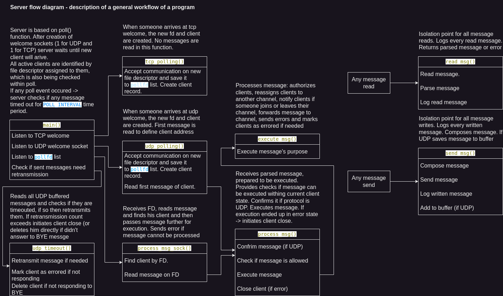

# IPK2024 Chat client

Author: Sniehovskyi Nikita (xsnieh00). Date: 22.04.2024.

Table of contents:
1. [Overview of the project](#overview)
2. [Theory](#theory)
3. [Source code implementation](#source-code-implementation)
4. [Bibliography](#bibliography)
5. [Testing](#testing)

## Overview

Implementation of chat server which works on UDP and TCP protocols to communicate with clients. It receives messages from clients, handles them and sends messages to another clients. Projects specifications are described in IPK Project 2: Chat server using IPK24-CHAT protocol [Project2].

Program is implemented using C language.
Root directory contains Makefile file, to build project use 'make' command in terminal, which will generate ipk24chat-server executable.

List of executable arguments (specified in [Project2]):
- -l: (required) IP address on which server should listen
- -p: (default is 4567) uint16 Server port
- -d: (default is 250) uint16 UDP confirmation timeout
- -r: (default is 3) uint8 Maximum number of UDP retransmissions
- -h: Prints program help output and exits

Server output consists of logging received and sent messages in this format:
```
RECV {FROM_IP}:{FROM_PORT} | {MESSAGE_TYPE}\n
```
```
SENT {TO_IP}:{TO_PORT} | {MESSAGE_TYPE}\n
```

## Theory

From network perspective project can be divided into 3 problems:
- [UDP communication](#udp-communication)
- [TCP communication](#tcp-communication)
- [Message translation](#message-translation)

#### UDP Communication

Since whole communication is stateless some problems occure:
- Client identification: implemented using port numbers. Each client gets unique port number which is defined after successful authorization. Server will typicaly answer to authorization message from different port.
- Message delivery: to ensure that both parties have received message they should send confirm messages whenever they receive message from other side.

Description of UDP message format can be found [here](https://git.fit.vutbr.cz/NESFIT/IPK-Projects-2024/src/branch/master/Project%201#message-contents) [Project1]

#### TCP Communication

Communication is stateful so there is much less problems within communication.
The only problem with TCP communication is that there is no guarantee that message will arrive as complete message.

#### Message translation

For each protocol different message encoding is being used:
- UDP protocol uses custom message definition (specified [here](https://git.fit.vutbr.cz/NESFIT/IPK-Projects-2024/src/branch/master/Project%201#message-contents) [Project1])
- TCP protocol is based on [RFC5234]. Rules are specified as follow:

```
; core content components
ID        = 1*20   ( ALPHA / DIGIT / "-" )
SECRET    = 1*128  ( ALPHA / DIGIT / "-" )
CONTENT   = 1*1400 ( VCHAR / SP )
DNAME     = 1*20   VCHAR

; additional content components
is     = SP "IS"    SP
as     = SP "AS"    SP
using  = SP "USING" SP

; message content variant parts
contentJoin     = "JOIN"     SP ID    as DNAME
contentAuth     = "AUTH"     SP ID    as DNAME using SECRET
contentMessage  = "MSG FROM" SP DNAME is CONTENT
contentError    = "ERR FROM" SP DNAME is CONTENT
;
contentReply    = "REPLY" SP ( "OK" / "NOK" ) is CONTENT
contentBye      = "BYE"

; message content variants
content  =  contentAuth
content  =/ contentJoin
content  =/ contentMessage
content  =/ contentError
content  =/ contentReply
content  =/ contentBye

; each message is is either variant terminated with "\r\n"
message = content CRLF
```
(specified [here](https://git.fit.vutbr.cz/NESFIT/IPK-Projects-2024/src/branch/master/Project%201#message-grammar) [Project1])

## Source code implementation

General points of program flow are visualy described in flow diagram:



Diagram of all available states can be found [here](https://git.fit.vutbr.cz/NESFIT/IPK-Projects-2024/src/branch/master/Project%201#specification) [Project1]

Main points from it:
- Server is using poll() function for clients handling;
- At the start server listens on TCP and UDP welcome sockets. When message occures on one of them, new file descriptor is generated and new client is created;
- Each client has file descriptor assigned to him and his net address which identify him;
- For UDP timeout proccessing server uses polling interval of poll() function. It selects the lowest timeout int the confirmation queue and if no events occured withing this interval timeouted messages are proccessed. This solution is more optimized than creation of separate threads for every message, but it causes than timeout time won't be precise if one of the FDs interrupted poll() sleep. Time mistake can be minimized by lowering POLL_INTERVAL constant in src/types.h
- Enormous memory allocations are caused by regex.

## Bibliography

[Project1] Dolejška, D. _Client for a chat server using IPK24-CHAT protocol_ [online]. February 2024. [cited 2024-04-22]. Available at: https://git.fit.vutbr.cz/NESFIT/IPK-Projects-2024/src/branch/master/Project%201

[Project2] Dolejška, D. _IPK Project 2: Chat server using IPK24-CHAT protocol_ [online]. February 2024. [cited 2024-04-22]. Available at: https://git.fit.vutbr.cz/NESFIT/IPK-Projects-2024/src/branch/master/Project%202/iota

[RFC5234] Crocker, D. and Overell, P. _Augmented BNF for Syntax Specifications: ABNF_ [online]. January 2008. [cited 2024-04-22]. DOI: 10.17487/RFC5234. Available at: https://datatracker.ietf.org/doc/html/rfc5234

[RFC9293] Eddy, W. _Transmission Control Protocol (TCP)_ [online]. August 2022. [cited 2024-04-22]. DOI: 10.17487/RFC9293. Available at: https://datatracker.ietf.org/doc/html/rfc9293

[RFC768] Postel, J. _User Datagram Protocol_ [online]. March 1997. [cited 2024-04-22]. DOI: 10.17487/RFC0768. Available at: https://datatracker.ietf.org/doc/html/rfc768

## Testing

Testing was done manualy using my implementation of client from Project 1 and nc. Communication was monitorred using wireshark.
Server was running in Nix environment

##### Test case 1: Normal - Client shutdown

Testing: 1 UDP client + 1 TCP client, clients shutdown first

Result: OK

Wireshark: OK

Valgrind: OK

```
valgrind -s --leak-check=full --show-leak-kinds=all --track-origins=yes ./ipk24chat-server -l 127.0.0.1 -p 4567 -d 250 -r 3
```

Client1 (UDP):
```
/auth a a a
Success: Joined default channel.
Server: User b joined default.
b: Hey
Hello
Server: User b left default.
/close
```

Client2 (TCP):
```
/auth b b b 
Success: Joined default channel.
Hey
a: Hello
/close
```

Server log:
```
RECV 127.0.0.1:47379 | AUTH
SENT 127.0.0.1:47379 | CONFIRM
SENT 127.0.0.1:47379 | REPLY
RECV 127.0.0.1:47379 | CONFIRM
RECV 127.0.0.1:57132 | AUTH
SENT 127.0.0.1:47379 | MSG
SENT 127.0.0.1:57132 | REPLY
RECV 127.0.0.1:47379 | CONFIRM
RECV 127.0.0.1:57132 | MSG
SENT 127.0.0.1:47379 | MSG
RECV 127.0.0.1:47379 | CONFIRM
RECV 127.0.0.1:47379 | MSG
SENT 127.0.0.1:47379 | CONFIRM
SENT 127.0.0.1:57132 | MSG
RECV 127.0.0.1:57132 | BYE
SENT 127.0.0.1:47379 | MSG
RECV 127.0.0.1:47379 | CONFIRM
RECV 127.0.0.1:47379 | BYE
SENT 127.0.0.1:47379 | CONFIRM
```

Wireshark:
```
1	0.000000000	    127.0.0.1	127.0.0.1	IPK24-CHAT	51	C → Server | ID=0, Type=auth, UserName=a, DisplayName=a, Secret=a
2	0.000273727	    127.0.0.1	127.0.0.1	IPK24-CHAT	45	Server → C | Type=confirm, RefID=0
3	0.000281451	    127.0.0.1	127.0.0.1	IPK24-CHAT	72	Server → C | ID=1, Type=reply, Result=OK, RefID=0, Content=Joined default channel.
4	0.000427910	    127.0.0.1	127.0.0.1	IPK24-CHAT	45	C → Server | Type=confirm, RefID=1
8	13.630172895	127.0.0.1	127.0.0.1	IPK24-CHAT	87	C → Server | AUTH b AS b USING b
10	13.630572404	127.0.0.1	127.0.0.1	IPK24-CHAT	75	Server → C | ID=2, Type=msg, DisplayName=Server, Content=User b joined default.
11	13.630593299	127.0.0.1	127.0.0.1	IPK24-CHAT	103	Server → C | REPLY OK IS Joined default channel.
13	13.630745648	127.0.0.1	127.0.0.1	IPK24-CHAT	45	C → Server | Type=confirm, RefID=2
14	29.380186917	127.0.0.1	127.0.0.1	IPK24-CHAT	85	C → Server | MSG FROM b IS Hey
15	29.409413018	127.0.0.1	127.0.0.1	IPK24-CHAT	51	Server → C | ID=4, Type=msg, DisplayName=b, Content=Hey
16	29.409579031	127.0.0.1	127.0.0.1	IPK24-CHAT	45	C → Server | Type=confirm, RefID=4
18	32.271736325	127.0.0.1	127.0.0.1	IPK24-CHAT	53	C → Server | ID=1, Type=msg, DisplayName=a, Content=Hello
19	32.276627013	127.0.0.1	127.0.0.1	IPK24-CHAT	45	Server → C | Type=confirm, RefID=1
20	32.276657176	127.0.0.1	127.0.0.1	IPK24-CHAT	87	Server → C | MSG FROM a IS Hello
31	37.566334021	127.0.0.1	127.0.0.1	IPK24-CHAT	71	C → Server | BYE
34	37.566722581	127.0.0.1	127.0.0.1	IPK24-CHAT	73	Server → C | ID=7, Type=msg, DisplayName=Server, Content=User b left default.
37	37.566910079	127.0.0.1	127.0.0.1	IPK24-CHAT	45	C → Server | Type=confirm, RefID=7
38	40.201334867	127.0.0.1	127.0.0.1	IPK24-CHAT	45	C → Server | ID=3, Type=bye
39	40.201508969	127.0.0.1	127.0.0.1	IPK24-CHAT	45	Server → C | Type=confirm, RefID=3
```

Valgrind:
```
==88094== HEAP SUMMARY:
==88094==     in use at exit: 0 bytes in 0 blocks
==88094==   total heap usage: 41,450 allocs, 41,450 frees, 57,931,028 bytes allocated
==88094== 
==88094== All heap blocks were freed -- no leaks are possible
==88094== 
==88094== ERROR SUMMARY: 0 errors from 0 contexts (suppressed: 0 from 0)
```

##### Test case 2: Normal - Server shutdown

Testing: 3 UDP clients + 3 TCP clients, server shutdown first

Result: OK

Wireshark: OK

Valgrind: OK

```
valgrind -s --leak-check=full --show-leak-kinds=all --track-origins=yes ./ipk24chat-server -l 127.0.0.1 -p 4567 -d 250 -r 3
```

Client1 (UDP):
```
/auth 1 1 udp1
Success: Joined default channel.
Server: User udp2 joined default.
Server: User udp3 joined default.
Server: User tcp1 joined default.
Server: User tcp2 joined default.
Server: User tcp6 joined default.
tcp6: Hello from tcp6
```
Client2 (UDP):
```
/auth 2 2 udp2
Success: Joined default channel.
Server: User udp3 joined default.
Server: User tcp1 joined default.
Server: User tcp2 joined default.
Server: User tcp6 joined default.
tcp6: Hello from tcp6
```
Client3 (UDP):
```
/auth 3 3 udp3
Success: Joined default channel.
Server: User tcp1 joined default.
Server: User tcp2 joined default.
Server: User tcp6 joined default.
tcp6: Hello from tcp6
```
Client4 (TCP):
```
/auth 4 4 tcp1
Success: Joined default channel.
Server: User tcp2 joined default.
Server: User tcp6 joined default.
tcp6: Hello from tcp6
```
Client5 (TCP):
```
/auth 5 5 tcp2
Success: Joined default channel.
Server: User tcp6 joined default.
tcp6: Hello from tcp6
```
Client6 (TCP):
```
/auth 6 6 tcp6
Success: Joined default channel.
Hello from tcp6
```

Server lot:
```
RECV 127.0.0.1:47337 | AUTH
SENT 127.0.0.1:47337 | CONFIRM
SENT 127.0.0.1:47337 | REPLY
RECV 127.0.0.1:47337 | CONFIRM
RECV 127.0.0.1:44105 | AUTH
SENT 127.0.0.1:44105 | CONFIRM
SENT 127.0.0.1:47337 | MSG
SENT 127.0.0.1:44105 | REPLY
RECV 127.0.0.1:47337 | CONFIRM
RECV 127.0.0.1:44105 | CONFIRM
RECV 127.0.0.1:41405 | AUTH
SENT 127.0.0.1:41405 | CONFIRM
SENT 127.0.0.1:47337 | MSG
SENT 127.0.0.1:44105 | MSG
SENT 127.0.0.1:41405 | REPLY
RECV 127.0.0.1:47337 | CONFIRM
RECV 127.0.0.1:44105 | CONFIRM
RECV 127.0.0.1:41405 | CONFIRM
RECV 127.0.0.1:42190 | AUTH
SENT 127.0.0.1:47337 | MSG
SENT 127.0.0.1:44105 | MSG
SENT 127.0.0.1:41405 | MSG
SENT 127.0.0.1:42190 | REPLY
RECV 127.0.0.1:47337 | CONFIRM
RECV 127.0.0.1:44105 | CONFIRM
RECV 127.0.0.1:41405 | CONFIRM
RECV 127.0.0.1:43000 | AUTH
SENT 127.0.0.1:47337 | MSG
SENT 127.0.0.1:44105 | MSG
SENT 127.0.0.1:41405 | MSG
SENT 127.0.0.1:42190 | MSG
SENT 127.0.0.1:43000 | REPLY
RECV 127.0.0.1:47337 | CONFIRM
RECV 127.0.0.1:44105 | CONFIRM
RECV 127.0.0.1:41405 | CONFIRM
RECV 127.0.0.1:49276 | AUTH
SENT 127.0.0.1:47337 | MSG
SENT 127.0.0.1:44105 | MSG
SENT 127.0.0.1:41405 | MSG
SENT 127.0.0.1:42190 | MSG
SENT 127.0.0.1:43000 | MSG
SENT 127.0.0.1:49276 | REPLY
RECV 127.0.0.1:47337 | CONFIRM
RECV 127.0.0.1:44105 | CONFIRM
RECV 127.0.0.1:41405 | CONFIRM
RECV 127.0.0.1:49276 | MSG
SENT 127.0.0.1:47337 | MSG
SENT 127.0.0.1:44105 | MSG
SENT 127.0.0.1:41405 | MSG
SENT 127.0.0.1:42190 | MSG
SENT 127.0.0.1:43000 | MSG
RECV 127.0.0.1:47337 | CONFIRM
RECV 127.0.0.1:44105 | CONFIRM
RECV 127.0.0.1:41405 | CONFIRM
^CSENT 127.0.0.1:47337 | BYE
SENT 127.0.0.1:44105 | BYE
SENT 127.0.0.1:41405 | BYE
SENT 127.0.0.1:42190 | BYE
SENT 127.0.0.1:43000 | BYE
SENT 127.0.0.1:49276 | BYE
RECV 127.0.0.1:47337 | CONFIRM
RECV 127.0.0.1:47337 | BYE
SENT 127.0.0.1:47337 | CONFIRM
RECV 127.0.0.1:44105 | CONFIRM
RECV 127.0.0.1:44105 | BYE
SENT 127.0.0.1:44105 | CONFIRM
RECV 127.0.0.1:41405 | CONFIRM
RECV 127.0.0.1:41405 | BYE
SENT 127.0.0.1:41405 | CONFIRM
```
Wireshark:
```
1	0.000000000	    127.0.0.1	127.0.0.1	IPK24-CHAT	54	C → Server | ID=0, Type=auth, UserName=1, DisplayName=udp1, Secret=1
2	0.075263477	    127.0.0.1	127.0.0.1	IPK24-CHAT	45	Server → C | Type=confirm, RefID=0
3	0.079357775	    127.0.0.1	127.0.0.1	IPK24-CHAT	72	Server → C | ID=1, Type=reply, Result=OK, RefID=0, Content=Joined default channel.
4	0.079427681	    127.0.0.1	127.0.0.1	IPK24-CHAT	45	C → Server | Type=confirm, RefID=1
5	7.992878472	    127.0.0.1	127.0.0.1	IPK24-CHAT	54	C → Server | ID=0, Type=auth, UserName=2, DisplayName=udp2, Secret=2
6	8.003105524 	127.0.0.1	127.0.0.1	IPK24-CHAT	45	Server → C | Type=confirm, RefID=0
7	8.003973797	    127.0.0.1	127.0.0.1	IPK24-CHAT	78	Server → C | ID=3, Type=msg, DisplayName=Server, Content=User udp2 joined default.
8	8.004077728	    127.0.0.1	127.0.0.1	IPK24-CHAT	45	C → Server | Type=confirm, RefID=3
9	8.004197448	    127.0.0.1	127.0.0.1	IPK24-CHAT	72	Server → C | ID=4, Type=reply, Result=OK, RefID=0, Content=Joined default channel.
10	8.004350442	    127.0.0.1	127.0.0.1	IPK24-CHAT	45	C → Server | Type=confirm, RefID=4
11	16.498668589	127.0.0.1	127.0.0.1	IPK24-CHAT	54	C → Server | ID=0, Type=auth, UserName=3, DisplayName=udp3, Secret=3
12	16.509635731	127.0.0.1	127.0.0.1	IPK24-CHAT	45	Server → C | Type=confirm, RefID=0
13	16.509718954	127.0.0.1	127.0.0.1	IPK24-CHAT	78	Server → C | ID=6, Type=msg, DisplayName=Server, Content=User udp3 joined default.
14	16.509777491	127.0.0.1	127.0.0.1	IPK24-CHAT	78	Server → C | ID=7, Type=msg, DisplayName=Server, Content=User udp3 joined default.
15	16.509779376	127.0.0.1	127.0.0.1	IPK24-CHAT	45	C → Server | Type=confirm, RefID=6
16	16.509803072	127.0.0.1	127.0.0.1	IPK24-CHAT	45	C → Server | Type=confirm, RefID=7
17	16.509845545	127.0.0.1	127.0.0.1	IPK24-CHAT	72	Server → C | ID=8, Type=reply, Result=OK, RefID=0, Content=Joined default channel.
18	16.509908616	127.0.0.1	127.0.0.1	IPK24-CHAT	45	C → Server | Type=confirm, RefID=8
22	33.130126457	127.0.0.1	127.0.0.1	IPK24-CHAT	90	C → Server | AUTH 4 AS tcp1 USING 4
24	33.166865425	127.0.0.1	127.0.0.1	IPK24-CHAT	78	Server → C | ID=9, Type=msg, DisplayName=Server, Content=User tcp1 joined default.
25	33.166934081	127.0.0.1	127.0.0.1	IPK24-CHAT	45	C → Server | Type=confirm, RefID=9
26	33.166942751	127.0.0.1	127.0.0.1	IPK24-CHAT	78	Server → C | ID=10, Type=msg, DisplayName=Server, Content=User tcp1 joined default.
27	33.167024675	127.0.0.1	127.0.0.1	IPK24-CHAT	78	Server → C | ID=11, Type=msg, DisplayName=Server, Content=User tcp1 joined default.
28	33.167138274	127.0.0.1	127.0.0.1	IPK24-CHAT	45	C → Server | Type=confirm, RefID=10
29	33.167165838	127.0.0.1	127.0.0.1	IPK24-CHAT	45	C → Server | Type=confirm, RefID=11
30	33.167591364	127.0.0.1	127.0.0.1	IPK24-CHAT	103	Server → C | REPLY OK IS Joined default channel.
35	42.908854166	127.0.0.1	127.0.0.1	IPK24-CHAT	90	C → Server | AUTH 5 AS tcp2 USING 5
37	42.921026732	127.0.0.1	127.0.0.1	IPK24-CHAT	78	Server → C | ID=13, Type=msg, DisplayName=Server, Content=User tcp2 joined default.
38	42.921053262	127.0.0.1	127.0.0.1	IPK24-CHAT	45	C → Server | Type=confirm, RefID=13
39	42.921098385	127.0.0.1	127.0.0.1	IPK24-CHAT	78	Server → C | ID=14, Type=msg, DisplayName=Server, Content=User tcp2 joined default.
40	42.921152702	127.0.0.1	127.0.0.1	IPK24-CHAT	78	Server → C | ID=15, Type=msg, DisplayName=Server, Content=User tcp2 joined default.
41	42.921229905	127.0.0.1	127.0.0.1	IPK24-CHAT	45	C → Server | Type=confirm, RefID=14
42	42.921351888	127.0.0.1	127.0.0.1	IPK24-CHAT	45	C → Server | Type=confirm, RefID=15
43	42.921750041	127.0.0.1	127.0.0.1	IPK24-CHAT	112	Server → C | MSG FROM Server IS User tcp2 joined default.
45	42.921911247	127.0.0.1	127.0.0.1	IPK24-CHAT	103	Server → C | REPLY OK IS Joined default channel.
50	51.698137179	127.0.0.1	127.0.0.1	IPK24-CHAT	90	C → Server | AUTH 6 AS tcp6 USING 6
52	51.712640565	127.0.0.1	127.0.0.1	IPK24-CHAT	78	Server → C | ID=18, Type=msg, DisplayName=Server, Content=User tcp6 joined default.
53	51.712703923	127.0.0.1	127.0.0.1	IPK24-CHAT	78	Server → C | ID=19, Type=msg, DisplayName=Server, Content=User tcp6 joined default.
54	51.712771177	127.0.0.1	127.0.0.1	IPK24-CHAT	78	Server → C | ID=20, Type=msg, DisplayName=Server, Content=User tcp6 joined default.
55	51.712782256	127.0.0.1	127.0.0.1	IPK24-CHAT	45	C → Server | Type=confirm, RefID=18
56	51.712826679	127.0.0.1	127.0.0.1	IPK24-CHAT	112	Server → C | MSG FROM Server IS User tcp6 joined default.
58	51.712875598	127.0.0.1	127.0.0.1	IPK24-CHAT	45	C → Server | Type=confirm, RefID=19
59	51.712878049	127.0.0.1	127.0.0.1	IPK24-CHAT	112	Server → C | MSG FROM Server IS User tcp6 joined default.
61	51.712896250	127.0.0.1	127.0.0.1	IPK24-CHAT	45	C → Server | Type=confirm, RefID=20
62	51.712930651	127.0.0.1	127.0.0.1	IPK24-CHAT	103	Server → C | REPLY OK IS Joined default channel.
64	65.561602753	127.0.0.1	127.0.0.1	IPK24-CHAT	100	C → Server | MSG FROM tcp6 IS Hello from tcp6
66	65.899678452	127.0.0.1	127.0.0.1	IPK24-CHAT	66	Server → C | ID=24, Type=msg, DisplayName=tcp6, Content=Hello from tcp6
67	65.899809302	127.0.0.1	127.0.0.1	IPK24-CHAT	45	C → Server | Type=confirm, RefID=24
68	65.902701714	127.0.0.1	127.0.0.1	IPK24-CHAT	66	Server → C | ID=25, Type=msg, DisplayName=tcp6, Content=Hello from tcp6
69	65.902800715	127.0.0.1	127.0.0.1	IPK24-CHAT	66	Server → C | ID=26, Type=msg, DisplayName=tcp6, Content=Hello from tcp6
70	65.902865733	127.0.0.1	127.0.0.1	IPK24-CHAT	100	Server → C | MSG FROM tcp6 IS Hello from tcp6
71	65.902866038	127.0.0.1	127.0.0.1	IPK24-CHAT	45	C → Server | Type=confirm, RefID=25
72	65.902871869	127.0.0.1	127.0.0.1	IPK24-CHAT	45	C → Server | Type=confirm, RefID=26
74	65.902927420	127.0.0.1	127.0.0.1	IPK24-CHAT	100	Server → C | MSG FROM tcp6 IS Hello from tcp6
76	71.442940522	127.0.0.1	127.0.0.1	IPK24-CHAT	45	Server → C | ID=29, Type=bye
77	71.443158049	127.0.0.1	127.0.0.1	IPK24-CHAT	45	C → Server | Type=confirm, RefID=29
78	71.443188011	127.0.0.1	127.0.0.1	IPK24-CHAT	45	C → Server | ID=1, Type=bye
79	71.444096227	127.0.0.1	127.0.0.1	IPK24-CHAT	45	Server → C | ID=30, Type=bye
80	71.444277194	127.0.0.1	127.0.0.1	IPK24-CHAT	45	C → Server | Type=confirm, RefID=30
81	71.444304884	127.0.0.1	127.0.0.1	IPK24-CHAT	45	C → Server | ID=1, Type=bye
82	71.444324522	127.0.0.1	127.0.0.1	IPK24-CHAT	45	Server → C | ID=31, Type=bye
83	71.444424009	127.0.0.1	127.0.0.1	IPK24-CHAT	45	C → Server | Type=confirm, RefID=31
84	71.444445694	127.0.0.1	127.0.0.1	IPK24-CHAT	45	C → Server | ID=1, Type=bye
85	71.444961344	127.0.0.1	127.0.0.1	IPK24-CHAT	71	Server → C | BYE
89	71.445298712	127.0.0.1	127.0.0.1	IPK24-CHAT	71	C → Server | BYE
93	71.446887856	127.0.0.1	127.0.0.1	IPK24-CHAT	71	Server → C | BYE
96	71.446964229	127.0.0.1	127.0.0.1	IPK24-CHAT	71	Server → C | BYE
102	71.447120017	127.0.0.1	127.0.0.1	IPK24-CHAT	71	C → Server | BYE
105	71.448155456	127.0.0.1	127.0.0.1	IPK24-CHAT	45	Server → C | Type=confirm, RefID=1
106	71.450208867	127.0.0.1	127.0.0.1	IPK24-CHAT	45	Server → C | Type=confirm, RefID=1
107	71.450557478	127.0.0.1	127.0.0.1	IPK24-CHAT	45	Server → C | Type=confirm, RefID=1
```
Valgrind:
```
==90102== HEAP SUMMARY:
==90102==     in use at exit: 0 bytes in 0 blocks
==90102==   total heap usage: 43,352 allocs, 43,352 frees, 43,384,704 bytes allocated
==90102== 
==90102== All heap blocks were freed -- no leaks are possible
==90102== 
==90102== ERROR SUMMARY: 0 errors from 0 contexts (suppressed: 0 from 0)
```

##### Test case 3: Normal - Channel switch, Rename

Testing: 1 UDP client + 1 TCP client, channel switching

Result: OK

Wireshark: OK

Valgrind: OK


```
valgrind -s --leak-check=full --show-leak-kinds=all --track-origins=yes ./ipk24chat-server -l 127.0.0.1 -p 4567 -d 250 -r 3
```

Client1 (UDP):
```
/auth 1 1 udp1
Success: Joined default channel.
Server: User tcp2 joined default.
tcp2: Hello from tcp
new_tcp: Hello from renamed tcp
Server: User new_tcp left default.
Server: User new_tcp joined default.
Hello from udp 
/rename new_udp
/join nondefault
Success: You joined nondefault channel.
Server: User new_tcp joined nondefault.
UDP left channel with old name but here it has new name
/close
```

Client2 (TCP):
```
/auth 2 2 tcp2
Success: Joined default channel.
Hello from tcp
/rename new_tcp
Hello from renamed tcp
/join nondefault
Success: You joined nondefault channel.
Noone in channel
/join default
Success: You joined default channel.
udp1: Hello from udp
Server: User udp1 left default.
/join nondefault 
Success: You joined nondefault channel.
new_udp: UDP left channel with old name but here it has new name
Server: User new_udp left nondefault.
/close
```

Server log:
```
RECV 127.0.0.1:57116 | AUTH
SENT 127.0.0.1:57116 | CONFIRM
SENT 127.0.0.1:57116 | REPLY
RECV 127.0.0.1:57116 | CONFIRM
RECV 127.0.0.1:45476 | AUTH
SENT 127.0.0.1:57116 | MSG
SENT 127.0.0.1:45476 | REPLY
RECV 127.0.0.1:57116 | CONFIRM
RECV 127.0.0.1:45476 | MSG
SENT 127.0.0.1:57116 | MSG
RECV 127.0.0.1:57116 | CONFIRM
RECV 127.0.0.1:45476 | MSG
SENT 127.0.0.1:57116 | MSG
RECV 127.0.0.1:57116 | CONFIRM
RECV 127.0.0.1:45476 | JOIN
SENT 127.0.0.1:57116 | MSG
SENT 127.0.0.1:45476 | REPLY
RECV 127.0.0.1:57116 | CONFIRM
RECV 127.0.0.1:45476 | MSG
RECV 127.0.0.1:45476 | JOIN
SENT 127.0.0.1:57116 | MSG
SENT 127.0.0.1:45476 | REPLY
RECV 127.0.0.1:57116 | CONFIRM
RECV 127.0.0.1:57116 | MSG
SENT 127.0.0.1:57116 | CONFIRM
SENT 127.0.0.1:45476 | MSG
RECV 127.0.0.1:57116 | JOIN
SENT 127.0.0.1:57116 | CONFIRM
SENT 127.0.0.1:45476 | MSG
SENT 127.0.0.1:57116 | REPLY
RECV 127.0.0.1:57116 | CONFIRM
RECV 127.0.0.1:45476 | JOIN
SENT 127.0.0.1:57116 | MSG
SENT 127.0.0.1:45476 | REPLY
RECV 127.0.0.1:57116 | CONFIRM
RECV 127.0.0.1:57116 | MSG
SENT 127.0.0.1:57116 | CONFIRM
SENT 127.0.0.1:45476 | MSG
RECV 127.0.0.1:57116 | MSG
SENT 127.0.0.1:57116 | CONFIRM
RECV 127.0.0.1:57116 | BYE
SENT 127.0.0.1:57116 | CONFIRM
SENT 127.0.0.1:45476 | MSG
RECV 127.0.0.1:45476 | BYE
```

Wireshark:
```
1	0.000000000	    127.0.0.1	127.0.0.1	IPK24-CHAT	54	C → Server | ID=0, Type=auth, UserName=1, DisplayName=udp1, Secret=1
2	0.070256788	    127.0.0.1	127.0.0.1	IPK24-CHAT	45	Server → C | Type=confirm, RefID=0
3	0.074224673	    127.0.0.1	127.0.0.1	IPK24-CHAT	72	Server → C | ID=1, Type=reply, Result=OK, RefID=0, Content=Joined default channel.
4	0.074370731	    127.0.0.1	127.0.0.1	IPK24-CHAT	45	C → Server | Type=confirm, RefID=1
8	6.906162648	    127.0.0.1	127.0.0.1	IPK24-CHAT	90	C → Server | AUTH 2 AS tcp2 USING 2
10	6.943607401	    127.0.0.1	127.0.0.1	IPK24-CHAT	78	Server → C | ID=2, Type=msg, DisplayName=Server, Content=User tcp2 joined default.
11	6.943667149	    127.0.0.1	127.0.0.1	IPK24-CHAT	45	C → Server | Type=confirm, RefID=2
12	6.944329153	    127.0.0.1	127.0.0.1	IPK24-CHAT	103	Server → C | REPLY OK IS Joined default channel.
14	15.105857912	127.0.0.1	127.0.0.1	IPK24-CHAT	99	C → Server | MSG FROM tcp2 IS Hello from tcp
16	15.445225600	127.0.0.1	127.0.0.1	IPK24-CHAT	65	Server → C | ID=4, Type=msg, DisplayName=tcp2, Content=Hello from tcp
17	15.445317617	127.0.0.1	127.0.0.1	IPK24-CHAT	45	C → Server | Type=confirm, RefID=4
18	34.874431082	127.0.0.1	127.0.0.1	IPK24-CHAT	110	C → Server | MSG FROM new_tcp IS Hello from renamed tcp
20	35.222092745	127.0.0.1	127.0.0.1	IPK24-CHAT	76	Server → C | ID=5, Type=msg, DisplayName=new_tcp, Content=Hello from renamed tcp
21	35.222253707	127.0.0.1	127.0.0.1	IPK24-CHAT	45	C → Server | Type=confirm, RefID=5
22	45.663007921	127.0.0.1	127.0.0.1	IPK24-CHAT	94	C → Server | JOIN nondefault AS new_tcp
24	45.675914864	127.0.0.1	127.0.0.1	IPK24-CHAT	79	Server → C | ID=6, Type=msg, DisplayName=Server, Content=User new_tcp left default.
25	45.676009827	127.0.0.1	127.0.0.1	IPK24-CHAT	45	C → Server | Type=confirm, RefID=6
26	45.676631543	127.0.0.1	127.0.0.1	IPK24-CHAT	110	Server → C | REPLY OK IS You joined nondefault channel.
33	59.875773631	127.0.0.1	127.0.0.1	IPK24-CHAT	104	C → Server | MSG FROM new_tcp IS Noone in channel
35	63.849185428	127.0.0.1	127.0.0.1	IPK24-CHAT	91	C → Server | JOIN default AS new_tcp
37	63.860079635	127.0.0.1	127.0.0.1	IPK24-CHAT	81	Server → C | ID=8, Type=msg, DisplayName=Server, Content=User new_tcp joined default.
38	63.860154798	127.0.0.1	127.0.0.1	IPK24-CHAT	45	C → Server | Type=confirm, RefID=8
39	63.860177591	127.0.0.1	127.0.0.1	IPK24-CHAT	107	Server → C | REPLY OK IS You joined default channel.
41	75.422683763	127.0.0.1	127.0.0.1	IPK24-CHAT	65	C → Server | ID=1, Type=msg, DisplayName=udp1, Content=Hello from udp
42	75.503415533	127.0.0.1	127.0.0.1	IPK24-CHAT	45	Server → C | Type=confirm, RefID=1
43	75.504093797	127.0.0.1	127.0.0.1	IPK24-CHAT	99	Server → C | MSG FROM udp1 IS Hello from udp
45	90.607600825	127.0.0.1	127.0.0.1	IPK24-CHAT	64	C → Server | ID=2, Type=join, ChannelId=nondefault, DisplayName=new_udp
46	90.617349513	127.0.0.1	127.0.0.1	IPK24-CHAT	45	Server → C | Type=confirm, RefID=2
47	90.617541949	127.0.0.1	127.0.0.1	IPK24-CHAT	110	Server → C | MSG FROM Server IS User udp1 left default.
49	90.617650828	127.0.0.1	127.0.0.1	IPK24-CHAT	79	Server → C | ID=14, Type=reply, Result=OK, RefID=512, Content=You joined nondefault channel.
50	90.617719701	127.0.0.1	127.0.0.1	IPK24-CHAT	45	C → Server | Type=confirm, RefID=14
51	100.130398367	127.0.0.1	127.0.0.1	IPK24-CHAT	94	C → Server | JOIN nondefault AS new_tcp
52	100.140805022	127.0.0.1	127.0.0.1	IPK24-CHAT	84	Server → C | ID=15, Type=msg, DisplayName=Server, Content=User new_tcp joined nondefault.
53	100.140951253	127.0.0.1	127.0.0.1	IPK24-CHAT	110	Server → C | REPLY OK IS You joined nondefault channel.
54	100.140957378	127.0.0.1	127.0.0.1	IPK24-CHAT	45	C → Server | Type=confirm, RefID=15
60	134.655082199	127.0.0.1	127.0.0.1	IPK24-CHAT	109	C → Server | ID=3, Type=msg, DisplayName=new_udp, Content=UDP left channel with old name but here it has new name
61	134.780266210	127.0.0.1	127.0.0.1	IPK24-CHAT	109	C → Server | ID=3, Type=msg, DisplayName=new_udp, Content=UDP left channel with old name but here it has new name
62	134.826149533	127.0.0.1	127.0.0.1	IPK24-CHAT	45	Server → C | Type=confirm, RefID=3
63	134.826254523	127.0.0.1	127.0.0.1	IPK24-CHAT	143	Server → C | MSG FROM new_udp IS UDP left channel with old name but here it has new name
65	134.996427175	127.0.0.1	127.0.0.1	IPK24-CHAT	45	Server → C | Type=confirm, RefID=3
66	141.193181853	127.0.0.1	127.0.0.1	IPK24-CHAT	45	C → Server | ID=5, Type=bye
67	141.196989255	127.0.0.1	127.0.0.1	IPK24-CHAT	45	Server → C | Type=confirm, RefID=5
68	141.197849292	127.0.0.1	127.0.0.1	IPK24-CHAT	116	Server → C | MSG FROM Server IS User new_udp left nondefault.
70	144.422571816	127.0.0.1	127.0.0.1	IPK24-CHAT	71	C → Server | BYE
```

Valgrind:
```
==91761== HEAP SUMMARY:
==91761==     in use at exit: 0 bytes in 0 blocks
==91761==   total heap usage: 126,390 allocs, 126,390 frees, 184,172,096 bytes allocated
==91761== 
==91761== All heap blocks were freed -- no leaks are possible
==91761== 
==91761== ERROR SUMMARY: 0 errors from 0 contexts (suppressed: 0 from 0)
```


## Bibliography

[Project1] Dolejška, D. _Client for a chat server using IPK24-CHAT protocol_ [online]. February 2024. [cited 2024-04-22]. Available at: https://git.fit.vutbr.cz/NESFIT/IPK-Projects-2024/src/branch/master/Project%201

[Project2] Dolejška, D. _IPK Project 2: Chat server using IPK24-CHAT protocol_ [online]. February 2024. [cited 2024-04-22]. Available at: https://git.fit.vutbr.cz/NESFIT/IPK-Projects-2024/src/branch/master/Project%202/iota

[RFC5234] Crocker, D. and Overell, P. _Augmented BNF for Syntax Specifications: ABNF_ [online]. January 2008. [cited 2024-04-22]. DOI: 10.17487/RFC5234. Available at: https://datatracker.ietf.org/doc/html/rfc5234

[RFC9293] Eddy, W. _Transmission Control Protocol (TCP)_ [online]. August 2022. [cited 2024-04-22]. DOI: 10.17487/RFC9293. Available at: https://datatracker.ietf.org/doc/html/rfc9293

[RFC768] Postel, J. _User Datagram Protocol_ [online]. March 1997. [cited 2024-04-22]. DOI: 10.17487/RFC0768. Available at: https://datatracker.ietf.org/doc/html/rfc768