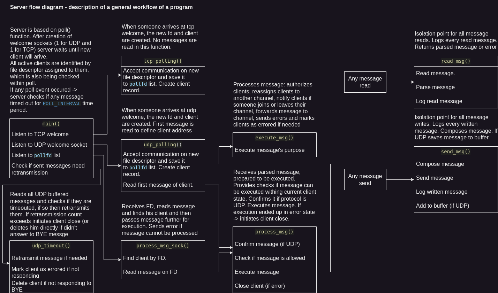

# IPK2024 Chat client

Author: Sniehovskyi Nikita (xsnieh00). Date: 22.04.2024.

Table of contents:
1. [Overview of the project](#overview)
2. [Theory](#theory)
3. [Source code implementation](#source-code-implementation)
4. [Bibliography](#bibliography)
5. [Testing](#testing)

## Overview

Implementation of chat server which works on UDP and TCP protocols to communicate with clients. It receives messages from clients, handles them and sends messages to another clients. Projects specifications are described in IPK Project 2: Chat server using IPK24-CHAT protocol [Project2].

Program is implemented using C language.
Root directory contains Makefile file, to build project use 'make' command in terminal, which will generate ipk24chat-server executable.

List of executable arguments (specified in [Project2]):
- -l: (required) IP address on which server should listen
- -p: (default is 4567) uint16 Server port
- -d: (default is 250) uint16 UDP confirmation timeout
- -r: (default is 3) uint8 Maximum number of UDP retransmissions
- -h: Prints program help output and exits

Server output consists of logging received and sent messages in this format:
```
RECV {FROM_IP}:{FROM_PORT} | {MESSAGE_TYPE}\n
```
```
SENT {TO_IP}:{TO_PORT} | {MESSAGE_TYPE}\n
```

## Theory

From network perspective project can be divided into 3 problems:
- [UDP communication](#udp-communication)
- [TCP communication](#tcp-communication)
- [Message translation](#message-translation)

#### UDP Communication

Since whole communication is stateless some problems occure:
- Client identification: implemented using port numbers. Each client gets unique port number which is defined after successful authorization. Server will typicaly answer to authorization message from different port.
- Message delivery: to ensure that both parties have received message they should send confirm messages whenever they receive message from other side.

#### TCP Communication

Communication is stateful so there is much less problems within communication.
The only problem with TCP communication is that there is no guarantee that message will arrive as complete message.

#### Message translation

For each protocol different message encoding is being used:
- UDP protocol uses custom message definition (specified [here](https://git.fit.vutbr.cz/NESFIT/IPK-Projects-2024/src/branch/master/Project%201#message-contents) [Project1])
- TCP protocol is based on [RFC5234]. Rules are specified as follow:

```
; core content components
ID        = 1*20   ( ALPHA / DIGIT / "-" )
SECRET    = 1*128  ( ALPHA / DIGIT / "-" )
CONTENT   = 1*1400 ( VCHAR / SP )
DNAME     = 1*20   VCHAR

; additional content components
is     = SP "IS"    SP
as     = SP "AS"    SP
using  = SP "USING" SP

; message content variant parts
contentJoin     = "JOIN"     SP ID    as DNAME
contentAuth     = "AUTH"     SP ID    as DNAME using SECRET
contentMessage  = "MSG FROM" SP DNAME is CONTENT
contentError    = "ERR FROM" SP DNAME is CONTENT
;
contentReply    = "REPLY" SP ( "OK" / "NOK" ) is CONTENT
contentBye      = "BYE"

; message content variants
content  =  contentAuth
content  =/ contentJoin
content  =/ contentMessage
content  =/ contentError
content  =/ contentReply
content  =/ contentBye

; each message is is either variant terminated with "\r\n"
message = content CRLF
```
(specified [here](https://git.fit.vutbr.cz/NESFIT/IPK-Projects-2024/src/branch/master/Project%201#message-grammar) [Project1])

## Source code implementation

General points of program flow are visualy described in flow diagram:



Diagram of all available states can be found [here](https://git.fit.vutbr.cz/NESFIT/IPK-Projects-2024/src/branch/master/Project%201#specification) [Project1]

Main points from it:
- Server is using poll() function for clients handling;
- At the start server listens on TCP and UDP welcome sockets. When message occures on one of them, new file descriptor is generated and new client is created;
- Each client has file descriptor assigned to him and his net address which identify him;
- For UDP timeout proccessing server uses polling interval of poll() function. It selects the lowest timeout int the confirmation queue and if no events occured withing this interval timeouted messages are proccessed. This solution is more optimized than creation of separate threads for every message, but it causes than timeout time won't be precise if one of the FDs interrupted poll() sleep. Time mistake can be minimized by lowering POLL_INTERVAL constant in src/types.h
- Enormous memory allocations are caused by regex.

## Bibliography

[Project1] Dolejška, D. _Client for a chat server using IPK24-CHAT protocol_ [online]. February 2024. [cited 2024-04-22]. Available at: https://git.fit.vutbr.cz/NESFIT/IPK-Projects-2024/src/branch/master/Project%201

[Project2] Dolejška, D. _IPK Project 2: Chat server using IPK24-CHAT protocol_ [online]. February 2024. [cited 2024-04-22]. Available at: https://git.fit.vutbr.cz/NESFIT/IPK-Projects-2024/src/branch/master/Project%202/iota

[RFC5234] Crocker, D. and Overell, P. _Augmented BNF for Syntax Specifications: ABNF_ [online]. January 2008. [cited 2024-04-22]. DOI: 10.17487/RFC5234. Available at: https://datatracker.ietf.org/doc/html/rfc5234

[RFC9293] Eddy, W. _Transmission Control Protocol (TCP)_ [online]. August 2022. [cited 2024-04-22]. DOI: 10.17487/RFC9293. Available at: https://datatracker.ietf.org/doc/html/rfc9293

[RFC768] Postel, J. _User Datagram Protocol_ [online]. March 1997. [cited 2024-04-22]. DOI: 10.17487/RFC0768. Available at: https://datatracker.ietf.org/doc/html/rfc768